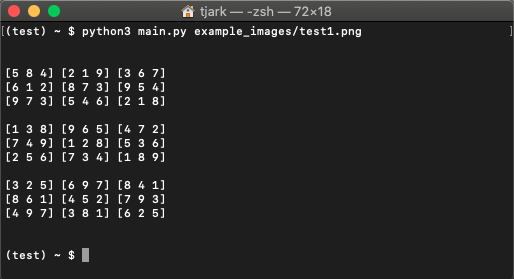
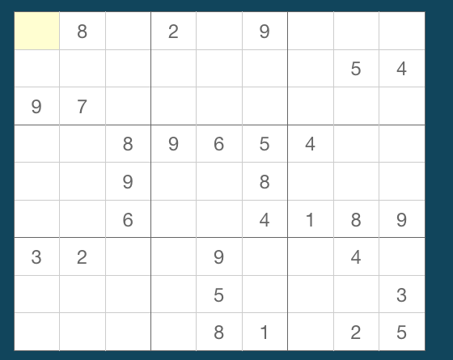
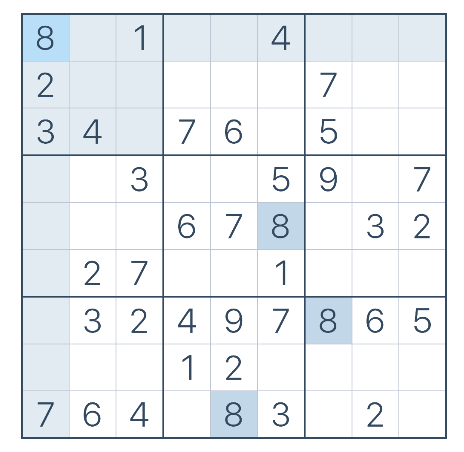
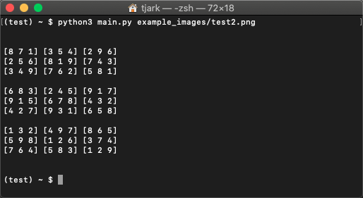
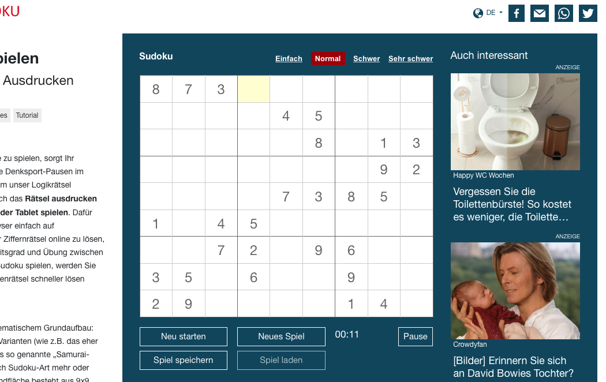
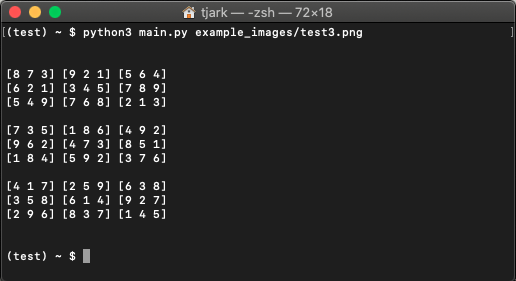

## Sudoku Solver Using Computer Vision

### 1. Function	
With requirements installed simply call the script with the image path, e.g		
python3 main.py image.png

Above is the output for the image test1.png below

### 2. Adaptable	
The main problem are unusual fonts, but this is easily adaptable by switching the <a href="templates">templates</a> to the respective font. For extremely big or small fonts a change in line 405 in the main.py is also neccessary.

### 3. Quick Rundown	
First the image gets segmented, so it is easier to detect the numbers and the sudoku itself, since there might be noise (see test3.png). Once the position of the sudoku is determined, the templates are being matched with different scaling factors. All points of interest will be saved in a nested list, which will be changed into a dictionary containing the position and the number of matches/occurences. Then the number with the most matches will be mapped into a 9x9 array. Afterwards a simple recursive algorithm solves the sudoku and the solution gets printed out.

### 4. Some examples	
This script was succesfully tested on:	
- <a href="https://sudoku.com">sudoku.com</a>	
- <a href="https://sudoku.tagesspiegel.de">sudoku.tagesspiegel.de</a>	
- <a href="https://sudoku.zeit.de">sudoku.zeit.de</a>

And failed on:	
- <a href="https://websudoku.com">websudoku.com</a>	

The other examples in this repo are visualized below
	
-
##### Test2.png	

##### Test2.png Solution	

-
-
-

##### Test3.png	

##### Test3.png Solution	

### Further Improvements	
Currently it takes around ~50 seconds from running the command to the printed solution, so making it faster by removing unneccessary loop iterations should work, but the accuracy would suffer, e.g by only scaling for 50 different factors instead of 100, some numbers might be detected wrong or not at all. Same for different fonts and sizes, by re-writing the code it should be possible to add multiple different font-templates, but this would slow the algorithm down again. To counter some of these problems a deep neural network might work, since it might be able to detect different fonts while being considerably faster, but the training could be difficult as well as the generalization, e.g MNIST dataset is 28x28 and it could be difficult to transfer that trained knowledge to a sudoku image where each number is not handwritten and might be smaller or bigger than these 28x28 dimensions. 
